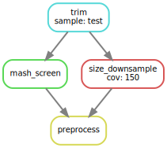

# Assembly Tools
Snakemake workflows used to assemble bacterial isolates.

Workflows were used to assemble five historical _Bacillus anthracis_ isolates soon to be published in [Microbiology Resource Annoucements](http://mra.asm.org).  

The _Bacillus anthracis_ assemblies have been deposited in DDBJ/ENA/GenBank under BioSample accession numbers [SAMN12620928](https://www.ncbi.nlm.nih.gov/biosample/SAMN12620928/), [SAMN12620929](https://www.ncbi.nlm.nih.gov/biosample/SAMN12620929/), [SAMN12620930](https://www.ncbi.nlm.nih.gov/biosample/SAMN12620930/), [SAMN12620931](https://www.ncbi.nlm.nih.gov/biosample/SAMN12620931/), and [SAMN12620932](https://www.ncbi.nlm.nih.gov/biosample/SAMN12620932/). The raw Illumina paired-end sequencing reads have been deposited in the Sequence Read Archive under accession numbers [SRR10019497](https://www.ncbi.nlm.nih.gov/sra/?term=SRR10019497), [SRR10019498](https://www.ncbi.nlm.nih.gov/sra/?term=SRR10019498), [SRR10019499](https://www.ncbi.nlm.nih.gov/sra/?term=SRR10019499), [SRR10019500](https://www.ncbi.nlm.nih.gov/sra/?term=SRR10019500), and [SRR10019501](https://www.ncbi.nlm.nih.gov/sra/?term=SRR10019501).

# Installation
## Read preprocessing workflow installation
1. Install Anaconda
```
wget https://repo.continuum.io/miniconda/Miniconda3-latest-Linux-x86_64.sh
bash Miniconda3-latest-Linux-x86_64.sh
``` 
2. Download asm_tools
```
git clone git://github.com/bioforensics/asm_tools
```
OR

Download a [Release](https://github.com/bioforensics/asm_tools/releases)

 
3. Setup python environment and use conda to install required packages (mash, fastp, etc).
```
   cd asm_tools/preprocess
   conda create -f preprocess_env.yml
   conda activate bmap_preprocess
```

4. (Optional) Download databases for "mash screen" to check for contaminants. <br>
Mash Sketch databases for RefSeq release 88:
* [RefSeq88n.msh.gz](https://obj.umiacs.umd.edu/mash/screen/RefSeq88n.msh.gz): Genomes (k=21, s=1000), 1.2Gb uncompressed
* [RefSeq88p.msh.gz](https://obj.umiacs.umd.edu/mash/screen/RefSeq88p.msh.gz): Proteomes (k=9, s=1000), 1.1Gb uncompressed

5. Edit preprocess/config.yml with path to mash database
```
mashdb: path/to/mashdb
```

6. Run the read preprocessing workflow
```
path/to/asm_tools/preprocess/bmap_preprocess -r1 test/seq/test_R1.fastq.gz -r2 test/seq/test_R2.fastq.gz -s sample_name
```

## Singularity Container installation

 > singularity pull bmap_preprocess.sif library://dsommer/default/bmap/bmap_preprocess
 > singularity exec bmap_preprocess.sif -r1 test/seq/test_R1.fastq.gz -r2 test/seq/test_R2.fastq.gz -s test1
  

# Preprocessing Paired-End Reads

## Snakemake DAG



## Workflow outline
The preprocessing.smk Snakemake workflow prepares Illumina reads to be assembled.
1. Run fastp to trim adapter sequence, low quality bases, and very short reads.  By default, bases below Q20 at ends of reads will be trimmed. Any reads below length 75 and/or containing Ns will be removed.  
2. Run "mash screen" against RefSeq to check for contaminents.
3. Estimate genome size by building a k-mer profile on the reads.
4. Randomly downsample reads to 150× coverage of the estimated genome size using sample-reads program.


